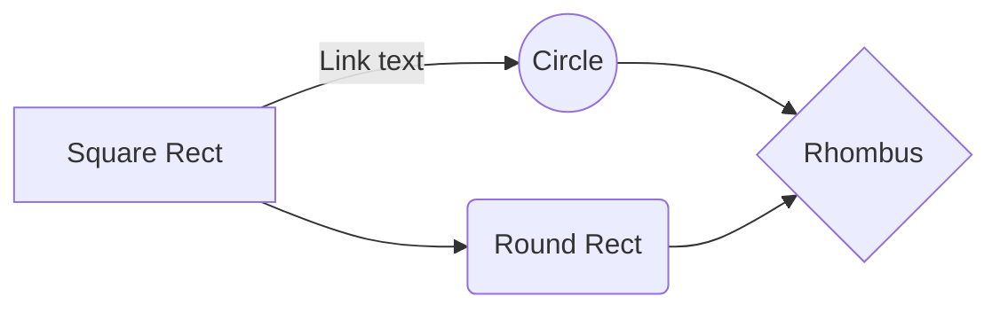

## Homework 1
### Association Analysis  
#### Dataset1:  
Select from kaggle.com / UCI  

#### Dataset2:  
Use IBM Quest Synthetic Data Generator
* https://sourceforge.net/projects/ibmquestdatagen/  
* Generate different datasets  

#### Implement Apriori Algorithm and apply on these datasets 
* Hash? Tree? (optional)  
* FP-growth  
#### Compare your results

---
### 環境
* macOS: 10.15.7（19H2）
* python: 3.7
* pycharm: 2020.2.3

### 程式檔案
* **main.py**:  
  主程式，放測試集的地方
* **apriori_algorithm.py**:  
  Apriori algorithm
* **FP_Growth.py**:  
  FP_Growth algorithm
* **比較data資料.ipynb**:  
  快速測試資料正確性的檔案
* **./dataset**:  
  存放測試資料集的資料夾
* **./result**:  
  存放結果的資料夾
  
  
### API

#### 資料集

呼叫已整理好的資料集（提供給演算使用）
* **deal_lecture_data(chose_type=1)**  
  講義中的範例: 
  
  ```python
  >>> deal_lecture_data()   
  [['a', 'c', 'd'],
   ['b', 'c', 'e'],
   ['a', 'b', 'c', 'e'],
   ['b', 'e']]
   
  >>> deal_lecture_data(2)
  [['11', '33', '44'],
   ['22', '33', '55'],
   ['11', '22', '33', '55'],
   ['22', '55']]                 
  ```
* **deal_kaggle_data(filename='./dataset/groceries - groceries.csv')**  
  [from kaggle groceries - groceries](https://www.kaggle.com/irfanasrullah/groceries?select=groceries+-+groceries.csv)  共9835筆交易
  
  ```python
  >>> deal_kaggle_data()
  [['citrus fruit', 'semi-finished bread', 'margarine', 'ready soups'], 
   ['tropical fruit', 'yogurt', 'coffee'], 
   ['whole milk'],
   ...] 
  ```
* **deal_IBM_data(filename='./dataset/test_data.csv')**  
  from IBM Quest Synthetic Data Generator
  
    ```python
  >>> deal_IBM_data()
  [['118', '266', '364', '427', '628', '673', '868', '904'], 
   ['40', '316', '594', '858', '870', '871', '917'], 
   ['0', '132', '169', '209', '314', '439', '482', '553', '592', '642', '885'], 
   ['73', '128', '188', '319', '374', '432', '456', '511', '705', '707', '756', '767', '825', '894'], 
   ...]
    ```
  
#### 測試 
* **class Apriori_test_set:**
    
    * **test_from_lecture(chose_type=1, min_support=2)**  
      
      ```python 
      >>> Apriori_test_set.test_from_lecture(min_support=2)
      {('a',): 2, ('c',): 3, ('b',): 3, ('e',): 3, ('a', 'c'): 2, ('b', 'c'): 2, ('b', 'e'): 3, ('c', 'e'): 2, ('b', 'c', 'e'): 2}
      ```
    * **test_from_kaggle(min_support=50)**  
      
      ```python
      >>> Apriori_test_set.test_from_kaggle(600)
      {('citrus fruit',): 814, ('tropical fruit',): 1032, ('yogurt',): 1372, ('whole milk',): 2513, ('pip fruit',): 744, ('other vegetables',): 1903, ('rolls/buns',): 1809, ('bottled beer',): 792, ('bottled water',): 1087, ('soda',): 1715, ('fruit/vegetable juice',): 711, ('newspapers',): 785, ('pastry',): 875, ('root vegetables',): 1072, ('canned beer',): 764, ('sausage',): 924, ('brown bread',): 638, ('shopping bags',): 969, ('whipped/sour cream',): 705, ('domestic eggs',): 624, ('other vegetables', 'whole milk'): 736}
      ```
    * **test_from_IBMdata(min_support=18)**  
      
      ```python
      >>> Apriori_test_set.test_from_IBMdata(50)
      {('132',): 64, ('553',): 80, ('592',): 58, ('374',): 53, ('432',): 54, ('63',): 53, ('607',): 75, ('442',): 66, ('988',): 55, ('238',): 73, ('471',): 66, ('973',): 63, ('444',): 62, ('902',): 50, ('293',): 55, ('318',): 51, ('87',): 52, ('36',): 66, ('647',): 53, ('405',): 63}      
      ```
    
* **class FP_Growth_test_set:**  
    
    * **test_from_lecture(chose_type=1, min_support=2, confidence=0.6)**  
    
      ```python  
      >>> FP_Growth_test_set.test_from_lecture()
      {('a',): (('c',), 1.0), ('c',): (('b', 'e'), 0.6666666666666666), ('b',): (('c', 'e'), 0.6666666666666666), ('e',): (('b', 'c'), 0.6666666666666666), ('b', 'c'): (('e',), 1.0), ('b', 'e'): (('c',), 0.6666666666666666), ('c', 'e'): (('b',), 1.0)}
      ```
    
    * **test_from_kaggle(min_support=50)**  
    
      ```python
      >>> FP_Growth_test_set.test_from_kaggle()
      {('', 'other vegetables'): (('whole milk',), 0.6530612244897959), ('', 'whole milk'): (('other vegetables',), 0.6736842105263158), ('onions', 'root vegetables'): (('other vegetables',), 0.6021505376344086), ('bottled water', 'butter'): (('whole milk',), 0.6022727272727273), ('butter', 'domestic eggs'): (('whole milk',), 0.6210526315789474), ('domestic eggs', 'margarine'): (('whole milk',), 0.6219512195121951), ('domestic eggs', 'pip fruit'): (('whole milk',), 0.6235294117647059), ('domestic eggs', 'tropical fruit'): (('whole milk',), 0.6071428571428571), ('other vegetables', 'root vegetables', 'whipped/sour cream'): (('whole milk',), 0.6071428571428571), ('fruit/vegetable juice', 'other vegetables', 'yogurt'): (('whole milk',), 0.6172839506172839), ('other vegetables', 'pip fruit', 'root vegetables'): (('whole milk',), 0.675), ('pip fruit', 'root vegetables', 'whole milk'): (('other vegetables',), 0.6136363636363636), ('other vegetables', 'pip fruit', 'yogurt'): (('whole milk',), 0.625), ('citrus fruit', 'root vegetables', 'whole milk'): (('other vegetables',), 0.6333333333333333), ('root vegetables', 'tropical fruit', 'yogurt'): (('whole milk',), 0.7), ('other vegetables', 'tropical fruit', 'yogurt'): (('whole milk',), 0.6198347107438017), ('other vegetables', 'root vegetables', 'yogurt'): (('whole milk',), 0.6062992125984252)}
      ```
    
    * **test_from_IBMdata(min_support=18)**  
    
      ```python
      >>> FP_Growth_test_set.test_from_IBMdata()
      {('34',): (('87',), 1.0), ('493', '650'): (('187',), 1.0), ('493', '656'): (('132',), 0.9473684210526315), ('650', '656'): (('187', '493'), 1.0), ('187', '650'): (('493',), 1.0), ('187', '656'): (('493',), 0.9047619047619048), ('187', '493'): (('656',), 0.95), ('187', '493', '650'): (('132',), 0.9473684210526315), ('187', '493', '656'): (('132',), 0.9473684210526315), ('187', '650', '656'): (('493',), 1.0), ('493', '650', '656'): (('187',), 1.0), ('132', '493'): (('656',), 0.8571428571428571), ('132', '650'): (('187', '493'), 1.0), ('132', '187'): (('493', '656'), 0.9473684210526315), ('132', '187', '493'): (('656',), 0.9473684210526315), ('132', '187', '650'): (('493',), 1.0), ('132', '493', '650'): (('187',), 1.0), ('557',): (('405',), 0.95), ('427',): (('118',), 0.9047619047619048), ('187', '626'): (('493',), 1.0), ('493', '626'): (('132',), 0.9), ('132', '656'): (('493',), 1.0), ('132', '187', '656'): (('493',), 1.0), ('132', '493', '656'): (('187',), 1.0), ('132', '626'): (('493',), 0.9473684210526315)}
      ```
    
      
#### 演算法 
* **Apriori**
    
    * **apriori(transactions, min_support)**  
      
      * transactions: [['str', ...], ['str', 'str' ...], ...]  
      * min_support: int
      * return: {('item', ...): number, ...}
      
      ```python
      >>> transactions = [['a', 'c', 'd'],
                          ['b', 'c', 'e'],
                          ['a', 'b', 'c', 'e'],
                          ['b', 'e']]
      >>> apriori(transactions, 2)
      {('a',): 2, ('c',): 3, ('b',): 3, ('e',): 3, ('a', 'c'): 2, ('b', 'c'): 2, ('b', 'e'): 3, ('c', 'e'): 2, ('b', 'c', 'e'): 2}
      ```
    
* **FP_Growth**  

    * **find_frequent_patterns(transactions, min_support)**  
    
      * transactions: [['str', ...], ['str', 'str' ...], ...]  
      * min_support: int
      * return: {('item', ...): number, ...}
    
      ```python
      >>> transactions = [['a', 'c', 'd'], 
                          ['b', 'c', 'e'], 
                          ['a', 'b', 'c', 'e'], 
                          ['b', 'e']]
      >>> find_frequent_patterns(transactions, 2)
      {('a',): 2, ('c',): 3, ('b',): 3, ('e',): 3, ('a', 'c'): 2, ('b', 'c'): 2, ('b', 'e'): 3, ('c', 'e'): 2, ('b', 'c', 'e'): 2}
      ```
    
    * **generate_association_rules(patterns, confidence_threshold)**  
    
      * patterns: {('item', ...): number, ...}
      * confidence_threshold: float (right/left)
      * return: {(left): ((right), confidence)}
    
      ```python 
      >>> patterns = find_frequent_patterns(transactions, 2)
      >>> generate_association_rules(patterns, 0.6)
      {('a',): (('c',), 1.0), ('c',): (('b', 'e'), 0.6666666666666666), ('b',): (('c', 'e'), 0.6666666666666666), ('e',): (('b', 'c'), 0.6666666666666666), ('b', 'c'): (('e',), 1.0), ('b', 'e'): (('c',), 0.6666666666666666), ('c', 'e'): (('b',), 1.0)}
      ```
    
      
    
#### 存檔 

* **to_file(content: dict, filename)**

  將字典變數寫入指定文件名稱，存入./result

  * content: dict
  * filename: 可指定副檔名.json格式

### Compare results


