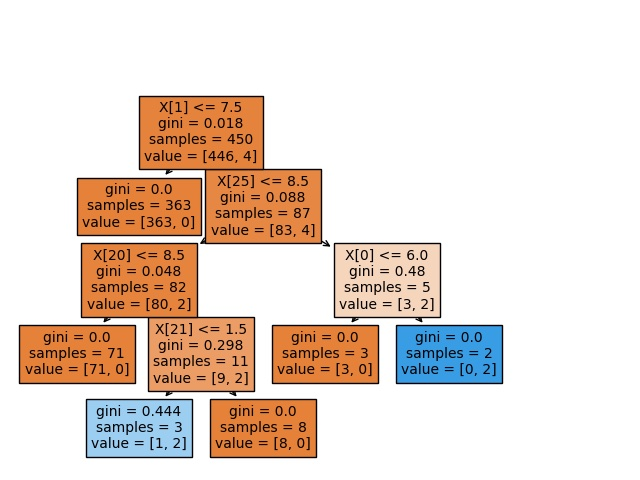
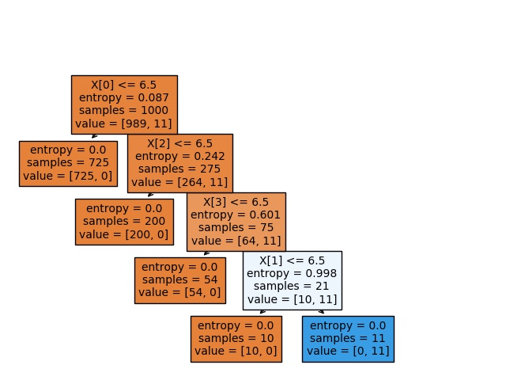
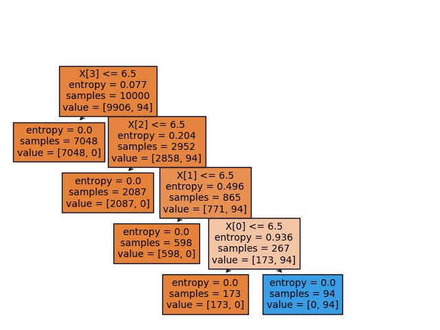

## Homework 2  
### Classification   

#### Goal
* Understand what classification systems do and the 
difference between real behavior of classification model 
and observed data 
#### Description
* Construct a classification model to observe the 
difference between real ‘right’ data and modeled data
#### Due: 11/24 9am

### Flow 
#### Step 1: 
Design a set of rules to classify data, e.g., classify students with good performance.
* You should design k features/attributes for your problems first.
* Use ‘absolutely right’ rules to generate your positive and negative data (the number of data = M) 
#### Step 2: Use the data generated in Step 1 to construct your classification model 
* Decision tree is basic requirement, you can add more classification models.
#### Step 3: 
Compare the rules in the decision tree from Step 2 and the rules you used to generate your ‘right’ data 
#### Step 4: 
Discuss anything you can

### Example 4 
* Select a good apple 
* Your “absolute right” rule (R) 
    * Color: dark red 
    * Knock voice: sharp 
    * Head color: green 
    * Weight: medium (hidden) 
* Use (R) to generate your data 
    * Add more attributes (20+ is better) 
* Use classifiers to classify your data 
    * Decision tree 
    * Naïve bayes 
    * …
    
---
## Rule
如何判斷一台“超酷”的電腦？
我們假定一台電腦共有30個屬性，其中用來判斷是否是一台“超酷”的電腦共有四個判斷條件(k = 4)，
而每個屬性(features/attributes)我們都用0~10的數字來表示，數字越大代表該屬性越好。
以下為“超酷”電腦所該擁有的四個條件：

* CPU: 7
* RAM: 7
* GPU: 7
* SSD: 7  

而剩下26個屬性我們分別用A~Z來表示。且他們的分數並不會影響我們判斷是否為“超酷”的電腦。
    
    
    
## Compare the rules
以下測試包含gini和entropy在不同數量的訓練集中的表現

* Gini
    可以發現在訓練450筆資料時，訓練集的資料造成DecisionTree第一個判斷就出錯了，且後面的分法中出現多次不相干的欄位加入到判斷中。
    以下為對相同DecisionTree做不同數量的訓練資料的可視化結果以及準確率(測試10000筆)
    
    * 450筆時的DecisionTree，Accuracy:98.35%
    
    * 1000筆時的DecisionTree，Accuracy:100%
    
    * 10000筆時的DecisionTree，Accuracy:100%
    
    
* Entropy
    可以發現利用entropy的策略在同樣是450筆的訓練集上效果表現比使用gini上好一點，DecisionTree的規則都有抓到對的欄位，但數值上還是差了一點，
    推測應該是訓練資料中沒有剛好符合邊界的。而當資料達到1000筆以上時，不管使用gini或是entropy效果都是相同的。

    * 450筆時的DecisionTree，Accuracy:99.72%
    
    * 1000筆時的DecisionTree，Accuracy:100%
    
    * 10000筆時的DecisionTree，Accuracy:100%
    

## Discuss
不管是訓練集或是測試集，我都是用亂數去產生的，然後再用規則去標註資料。
為了讓DecisionTree演算法預測的結果能和我的規則有些出入，也就是讓他預測不完全準確，我一開始訓練集就給他10000筆資料，
結果發現不知道是我的規則對DecisionTree來說太簡單還是他太強大，因為訓練集裡面也就不到100筆的標記的資料是1。
但不管跑幾次(不設定random seed)或是故意製造特殊的測試資料，發現他的準確率都是100%，
當把DecisionTree用plot_tree呈現才發現他的規則是完全準確的。
因此我開始慢慢調整筆數，發現在450筆的時候(random seed見原始碼)可以達到和規則相同的深度4，且稍有誤差(好寫報告)，
而只要是1000筆以上，DecisionTree不管怎麼調整以上使用的參數判斷都完全準確。

